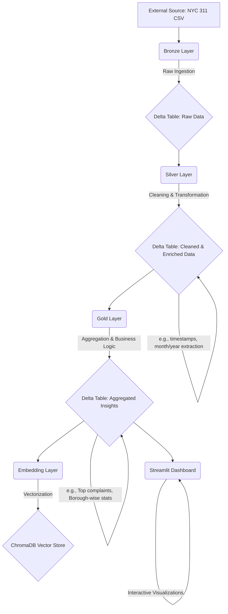
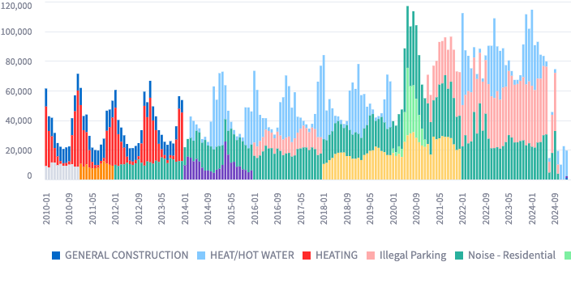
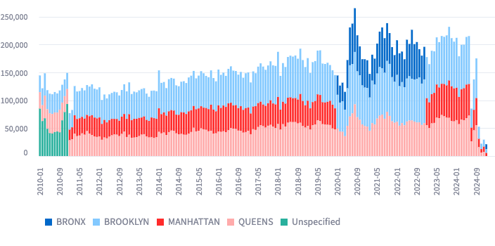

# 🗽 NYC 311 Complaints: A Spark & Delta Lake End-to-End Data Pipeline 🚀


> 🚧 **Early Development:** Expect frequent changes and evolving features.

This project demonstrates a complete data engineering and analytics workflow using the NYC 311 Service Requests dataset. We'll transform raw CSV data through **Bronze**, **Silver**, and **Gold** Delta Lake layers, culminating in an interactive analytics dashboard built with Streamlit.

## 🌟 Project Highlights

  * **Real-world Dataset**: Utilizes NYC Open Data – 311 Service Requests.
  * **Modern Tech Stack**:
      * **Apache Spark (Standalone)**: For distributed data processing.
      * **Delta Lake**: Ensuring ACID transactions, schema enforcement, and data versioning.
      * **Docker Compose**: For reproducible environment setup.
      * **Streamlit**: For building an interactive data dashboard.
  * **Medallion Architecture**:
      * **Bronze Layer**: Ingests raw CSV data into Delta format, preserving the original data.
      * **Silver Layer**: Cleans, validates, and enriches the data (e.g., adding temporal features like month and year).
      * **Gold Layer**: Aggregates data to create business-level insights, ready for analytics and reporting.
      * **Embedding Layer**: Converts gold layer insights into vector embeddings and ingests them into a ChromaDB vector store for semantic search.


## 🏗️ Project Structure

```bash
.
├── apps/
│   ├── constant/constants.py         # Centralized configuration & file paths
│   ├── process_all.py                # Orchestrates the entire ETL pipeline
│   ├── process_bronze_layer.py       # Script for Bronze layer processing
│   ├── process_silver_layer.py       # Script for Silver layer processing
│   ├── process_gold_layer.py         # Script for Gold layer processing
│   ├── process_embedding.py          # Script for Embedding layer processing
│   └── streamlit_app.py              # Streamlit dashboard application
├── data/                             # (Mounted) Directory for input (raw) and output (delta tables)
├── images/                           # Screenshots for README
├── Dockerfile                        # Defines the Spark environment
├── docker-compose.yml               # Configures Spark master and worker services
├── requirements.txt                  # Python dependencies
└── README.md                         # You are here!
```


## 🌊 Delta Lake Architecture Flow

This project implements the Medallion architecture, promoting data quality and usability:



**Why Delta Lake?**
Delta Lake enhances data reliability with ACID transactions, schema enforcement, and time travel capabilities, making it ideal for building robust data pipelines.


## 🛠️ Prerequisites

  * **Docker & Docker Compose**: For containerizing and running the Spark cluster.
  * **Python 3.8+**: For running scripts.
  * **(Optional but Recommended)** A Python virtual environment manager like `venv` or `conda`.


## 🚀 Getting Started: Setup & Execution

### 1\. Clone the Repository

```bash
git clone https://github.com/learningfun-dev/nyc311-delta-pipeline.git
cd nyc311-delta-pipeline
```

### 2\. Add the Dataset 📊

  * Download the NYC 311 Service Requests dataset (e.g., `311_Service_Requests_from_2010_to_Present.csv`).
  * Place the CSV file inside the `./data/raw/` directory.
      * *Note: The pipeline expects the CSV file to be in this location. You can configure the path in `apps/constant/constants.py`.*

### 3\. Set Up Python Environment (Optional)

Using Anaconda (example for macOS/Linux):

```bash
conda create --prefix ./venv python=3.12  # Or your preferred Python version
conda activate ./venv
```

### 4\. Install Dependencies

```bash
pip install -r requirements.txt
```

### 5\. Build and Start the Spark Cluster 🐳

Run the following command to build your custom Spark image (which includes all Python dependencies) and start the Spark master and worker services.

```bash
docker-compose up --build -d
```

  * **Option B: Scaled Workers (2 Master, 3 Workers)**

    ```bash
    docker-compose up --build -d --scale spark-worker=3
    ```

**Access Spark UI:**

  * Spark Master UI: [http://localhost:8080](http://localhost:8080)
  * Spark Cluster Connection URL (for jobs): `spark://localhost:7077`
  * Spark running jobs: [http://localhost:4040](http://localhost:4040)

### 6\. Run the ETL Pipeline ⚙️

Execute the main processing script to transform data through Bronze, Silver, and Gold layers:

  * **Option A: Execute each layer one by one (preferred)**

  ```bash
  python apps/process_bronze_layer.py
  python apps/process_silver_layer.py
  python apps/process_gold_layer.py
  ```

  * **Option B: Execute all layers with one command**

  ```bash
  python apps/process_all.py
  ```

This script will:

1.  Read the raw CSV from `./data/raw/`.
2.  Process and store data in Delta format at each layer within `./data/`.

### 7\. Launch the Streamlit Dashboard 📈

Start the interactive dashboard to visualize the processed data:

```bash
streamlit run apps/streamlit_app.py
```

Navigate to the URL provided by Streamlit (usually  [http://localhost:8501](http://localhost:8501)).


## ✨ Expected Output

  * **Bronze Layer (`./data/delta/bronze_nyc_311`)**:

      * Raw data from the CSV, converted to Delta Lake format.
      * Serves as the single source of truth for incoming data.

  * **Silver Layer (`./data/delta/silver_nyc_311`)**:

      * Cleaned and enriched version of the Bronze data.
      * Includes transformations like data type corrections, handling missing values, and feature engineering (e.g., extracting `year` and `month` from timestamps).
      * Partitioned by `year` and `month` for efficient querying.

  * **Gold Layer (`./data/delta/gold_nyc_311_top_complaints`, `./data/delta/gold_nyc_311_by_borough`)**:

      * **`top_complaints`**: Aggregated table showing the most frequent complaint types over time.
      * **`by_borough`**: Aggregated table providing a breakdown of complaint counts by NYC boroughs.
      * These tables are optimized for reporting and dashboarding.

  * **Streamlit Dashboard**:
    An interactive web application displaying key insights:

    **Top 3 Complaint Types per Month**:
      
    **Top 3 Borough Complaints by Month**:
      


## 📝 Configuration & Notes

  * **Pipeline Configuration**: Key settings like file paths, Spark configurations, and column names can be adjusted in `apps/constant/constants.py`.
  * **Data Volume Mapping**: Ensure the Docker volume mounts in `docker-compose.yml` correctly map your local `./data` directory to the `/opt/bitnami/spark/data-input` and `/opt/bitnami/spark/data-output` paths inside the Spark containers (or as configured). The current setup maps `./data` to `/opt/spark/work-dir/data` which is then referenced in constants.
  * **Large Datasets**: For very large datasets, you might need to adjust Spark's memory allocation in `docker-compose.yml` or Spark configurations within the scripts.
