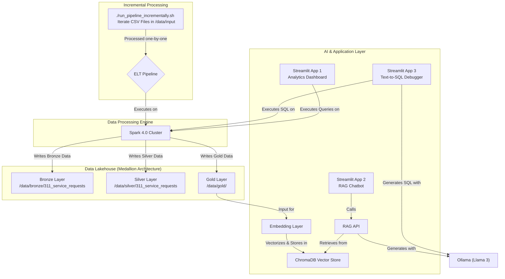
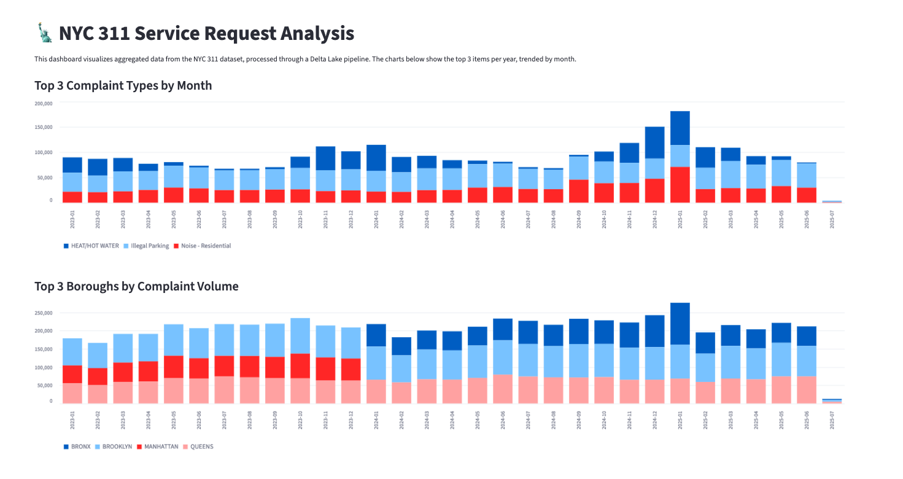
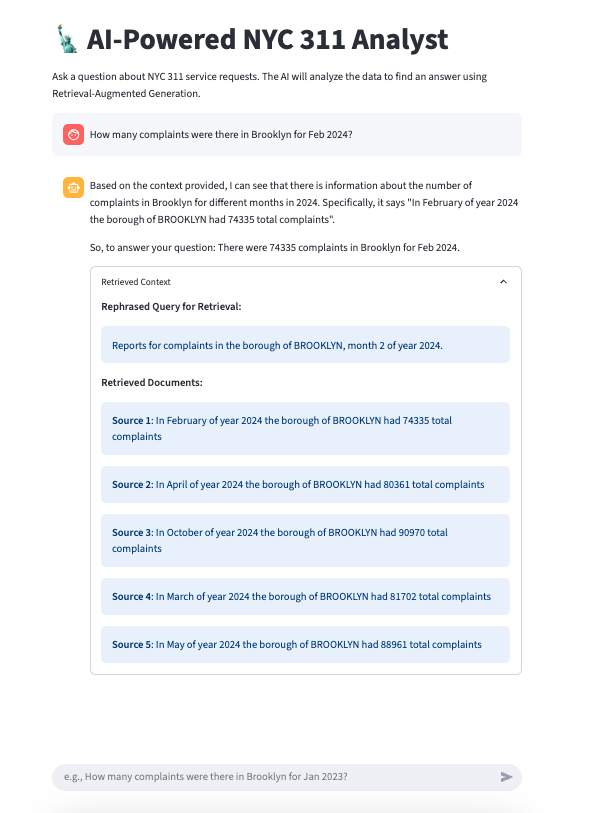
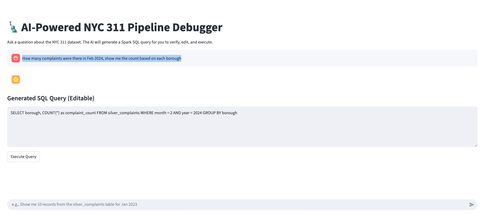
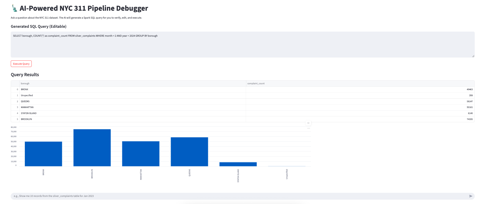

# **🗽 NYC 311 Complaints: A Spark & Delta Lake End-to-End Data Pipeline 🚀**

This project demonstrates a complete, end-to-end data engineering and MLOps workflow using the NYC 311 Service Requests dataset. We ingest raw CSV data, process it through a multi-layered Delta Lake architecture (**Bronze, Silver, Gold**), generate vector embeddings to power a Retrieval-Augmented Generation (RAG) application, and serve insights through multiple interactive Streamlit dashboards.

The entire environment is containerized with Docker Compose, featuring a **Spark 4.0** cluster, ensuring reproducibility and scalability.

## **🌟 Project Highlights**

* **End-to-End Pipeline**: From raw data ingestion to interactive, AI-powered applications.  
* **Modern Tech Stack**:  
  * **Apache Spark 4.0**: For high-performance, distributed data processing.  
  * **Delta Lake**: For building a reliable data lakehouse with ACID transactions and schema enforcement.  
  * **ChromaDB**: For storing vector embeddings to enable semantic search.  
  * **Ollama (Local LLMs)**: Uses llama3:instruct for generation and nomic-embed-text for embeddings, running entirely on your local machine.  
  * **LangChain**: For orchestrating the AI application logic.  
  * **Streamlit**: For creating interactive data dashboards and AI-powered chat interfaces.  
  * **Docker Compose**: For a fully reproducible, multi-container environment.  
* **Medallion Architecture**: Implements Bronze, Silver, and Gold layers for a robust and scalable data lakehouse.  
* **Dual AI Applications**: Features both a RAG-based chatbot for semantic Q\&A and a Text-to-SQL app for deep-dive analytics and debugging.

## **🏗️ Architecture Overview**

This project is composed of several interconnected components, from data ingestion to the final user-facing applications. The diagram below illustrates the complete workflow.

```mermaid
graph TD
    subgraph "Incremental Processing"
        A["./run_pipeline_incrementally.sh" <br> Iterate CSV Files in /data/input] -- "Processed one-by-one" --> B{ELT Pipeline};
    end

    subgraph "Data Processing Engine"
        C[Spark 4.0 Cluster]
    end
    
    B -- "Executes on" --> C

    subgraph "Data Lakehouse (Medallion Architecture)"
        D["Bronze Layer<br>/data/bronze/311_service_requests"]
        E["Silver Layer<br>/data/silver/311_service_requests"]
        F["Gold Layer<br>/data/gold/"]
    end

    C -- "Writes Bronze Data" --> D
    C -- "Writes Silver Data" --> E
    C -- "Writes Gold Data" --> F
    
    J["Ollama (Llama 3)"]
    subgraph "AI & Application Layer"
        G[Embedding Layer]
        H[ChromaDB Vector Store]
        I[RAG API]
        K[Streamlit App 1<br>Analytics Dashboard]
        L[Streamlit App 2<br>RAG Chatbot]
        M[Streamlit App 3<br>Text-to-SQL Debugger]
    end

    F -- "Input for" --> G
    G -- "Vectorizes & Stores in" --> H
    
    I -- "Retrieves from" --> H
    I -- "Generates with" --> J
    L -- "Calls" --> I

    M -- "Generates SQL with" --> J
    M -- "Executes SQL on" --> C
    
    K -- "Executes Queries on" --> C
```

### **How to Read the Diagram:**  
The process begins inside the Incremental Processing box, where the run\_pipeline\_incrementally.sh script processes each source CSV file one at a time. For each file, it utilizes the Spark 4.0 Cluster to execute the full data pipeline. This includes the ELT pipeline (Bronze, Silver, and Gold layers) and the subsequent Embedding Layer, which vectorizes the new data and stores it in ChromaDB. This ensures that after each file is processed, the entire system, from the data lakehouse to the vector store, is up-to-date.  
From there, the **AI & Application Layer** takes over. The three Streamlit applications then provide different ways to interact with the data:

* **Streamlit App 1** connects directly to the Spark Cluster to run analytical queries against the Gold tables for its dashboard.  
* **Streamlit App 2** interacts with the **RAG API**, which retrieves context from ChromaDB and uses Ollama to generate conversational answers.  
* **Streamlit App 3** acts as a powerful debugger, using Ollama to translate natural language into SQL and then executing those queries on the Spark Cluster against any of the data layers.


## **⚙️ Project Components Explained**

#### **1\. ELT Pipeline (Bronze, Silver, Gold Layers)**

This is the core data processing engine built on the Medallion Architecture.

* **Bronze Layer**: Ingests raw, unaltered data from the source CSV files into a Delta table. This serves as the permanent, immutable archive of the source data.  
* **Silver Layer**: Takes the raw data from the Bronze layer and applies cleaning, validation, and enrichment. This includes correcting data types, handling null values, removing duplicates, and creating new features like year and month for partitioning. The result is a queryable, reliable source for analytics.  
* **Gold Layer**: Aggregates the cleaned data from the Silver layer into business-level tables optimized for reporting and analysis. This project creates two Gold tables: top_complaints and by_borough.

#### **2\. Embedding Layer**

This layer acts as the bridge between the data pipeline and the AI application.

* **Functionality**: It reads the aggregated data from the Gold tables, converts each record into a descriptive sentence, and uses the nomic-embed-text model (via Ollama) to generate a vector representation of that sentence. These vectors are then "upserted" into the ChromaDB vector store.

#### **3\. RAG API**

A FastAPI service that powers the conversational AI chatbot.

* **Functionality**:  
  1. Receives a user's question from Streamlit App 2\.  
  2. Rephrases the question into a query suitable for vector search.  
  3. Uses the query to retrieve the most relevant documents (context) from ChromaDB.  
  4. Sends the original question, chat history, and the retrieved context to the llama3:instruct model.  
  5. Streams the LLM's final, context-aware answer back to the user.

#### **4\. Streamlit App 1: Analytics Dashboard**

A straightforward dashboard for direct data visualization.

* **Functionality**: Connects directly to a Spark session to read from the Gold Delta tables and displays pre-defined charts, such as the top complaint types and complaint volumes by borough.

#### **5\. Streamlit App 2: RAG Chatbot**

The primary user interface for the AI-powered analyst.

* **Functionality**: Provides a chat interface where users can ask natural language questions. It communicates with the RAG API to get context-aware answers and displays both the final answer and the source documents used for retrieval.

#### **6\. Streamlit App 3: Text-to-SQL Debugger**

A powerful tool for developers and data analysts.

* **Functionality**: Allows a user to ask a question in natural language. It uses the llama3:instruct model to convert the question into a Spark SQL query. The user can then verify or edit this query before executing it against *any* of the data layers (Bronze, Silver, or Gold), providing deep visibility into the entire pipeline.

## **💻 Docker Services**

The entire environment is managed by Docker Compose. The following services are defined:

| Service Name | Role | Access URL |
| :---- | :---- | :---- |
| zookeeper | State management for Spark HA | zookeeper:2181 (internal) |
| spark-master-1 / 2 | Spark Master nodes for cluster management | [http://localhost:8080](http://localhost:8080) |
| spark-worker-1/2/3 | Spark Worker nodes for executing tasks | N/A |
| chromadb | Vector database for storing embeddings | [http://localhost:8000](http://localhost:8000) |
| rag-api | FastAPI service for the RAG application | [http://localhost:8001](http://localhost:8001) |
| streamlit-app-1 | Analytics Dashboard | [http://localhost:8501](http://localhost:8501) |
| streamlit-app-2 | RAG Chatbot UI | [http://localhost:8502](http://localhost:8502) |
| streamlit-app-3 | Text-to-SQL Debugger UI | [http://localhost:8503](http://localhost:8503) |

## **📂 Project Structure**
```bash
.  
├── apps/                             # Main application source code  
│   ├── constant/constants.py         # Centralized configuration (paths, models, etc.)  
│   ├── download_paginated_data.py    # Script to download source data  
│   ├── main.py                       # Main entry point for the RAG API service  
│   ├── process_all.py                # Orchestrates the entire ETL pipeline run  
│   ├── process_bronze_layer.py       # Ingests raw data into the Bronze layer  
│   ├── process_embedding_layer.py    # Generates and stores vector embeddings  
│   ├── process_gold_layer.py         # Aggregates data into the Gold layer  
│   ├── process_silver_layer.py       # Cleans and transforms data into the Silver layer  
│   ├── streamlit_app_1.py            # UI for the Analytics Dashboard  
│   ├── streamlit_app_2.py            # UI for the RAG Chatbot  
│   ├── streamlit_app_3.py            # UI for the Text-to-SQL Debugger  
│   └── utils/                        # Shared utility functions  
│       ├── logging_utils.py          # Configures logging for Spark applications  
│       └── spark_utils.py            # Creates and configures the Spark session  
├── compose.env                       # Environment variables for Docker Compose services  
├── compose.yml                       # Defines and configures all Docker services  
├── data/                             # (Mounted) Stores all input, output, checkpoints, and DB data  
├── docker/                           # Contains all Dockerfile definitions  
│   ├── dockerfile_api                # Dockerfile for the FastAPI RAG service  
│   ├── dockerfile_chromadb           # Dockerfile for the ChromaDB vector store  
│   ├── dockerfile_spark              # Base Dockerfile for the Spark cluster  
│   ├── dockerfile_spark_streamlit    # Dockerfile for Streamlit apps needing Spark  
│   └── dockerfile_streamlit          # Dockerfile for basic Streamlit apps  
├── images/                           # Screenshots for the README file  
├── LICENSE                           # Project license file  
├── log4j2.properties                 # Logging configuration for Spark's JVM  
├── process_service_requests.ipynb    # Jupyter Notebook for exploratory data analysis  
├── README.md                         # You are here\!  
├── requirements/                     # Python dependency lists  
│   ├── api.txt                       # Dependencies for the RAG API  
│   ├── spark.txt                     # Dependencies for the Spark ETL jobs  
│   └── streamlit.txt                 # Dependencies for the Streamlit apps  
└── run_pipeline_incrementally.sh     # Script to process data files one by one
```
## **🚀 Getting Started: Setup & Execution**

### **1\. Prerequisites**

* **Docker & Docker Compose**: For containerizing and running all services.  
* **Python 3.12+**: For running local scripts.  
* **Ollama**: For running the LLMs locally.  
* **(Recommended)** A Python virtual environment manager like conda or venv.

### **2\. Set Up Local AI Environment (Ollama)**

This project requires a local Ollama server to be running on your host machine. The Docker containers will connect to this server.

1. **Install Ollama**: Download and install the Ollama application for your operating system from the official website:  
   * [https://ollama.com/](https://ollama.com/)

1. **Ensure Ollama is Running**: Make sure the Ollama application is running on your machine before you start the Docker services. The services are configured to connect to Ollama on the host.  

1. **Download the AI Models**: Once Ollama is installed and running, open your terminal and pull the required models.  
   * **For RAG and Text-to-SQL Generation:**
  ```bash
    ollama pull llama3:instruct
  ```
   * **For Text Embeddings:**  
  ```bash
    ollama pull nomic-embed-text
  ```
### **3\. Clone the Repository**

```bash
git clone https://github.com/learningfun-dev/nyc311-spark-delta-rag-pipeline.git 
cd nyc311-spark-delta-rag-pipeline
```
### **4\. Set Up Python Environment & Install Dependencies**

It's highly recommended to use a virtual environment.

# Example with conda  
```bash
conda create --prefix ./venv python=3.12 \-y  
conda activate ./venv
```

# Install all dependencies from the requirements files  
```bash
for req in requirements/\*.txt; do pip install \-r "$req"; done
```

### **5\. Add the Dataset 📊**

Run the provided script to download the 311 data. It will download one CSV file per month and place them in the `./data/input/` directory.

```bash
python apps/download_paginated_data.py
```
### **6\. Run the Incremental Pipeline (Recommended)**

This script processes each CSV file from the `./data/input/` directory one at a time, restarting the Spark cluster for each run to ensure a clean state.

**First, make the script executable:**
```bash
chmod +x run_pipeline_incrementally.sh
```
**Then, run the script:**

```bash
./run_pipeline_incrementally.sh
```
This will:

1. Start the persistent services (chromadb, zookeeper).  
2. Loop through each file, restarting the Spark cluster, running the full ETL + Embedding pipeline, and archiving the file.  
3. Shut down all services upon completion or interruption.

### **7\. Monitor the Pipeline**

You can monitor the progress of your Spark jobs using the following URLs:

* **Spark Master UI**: [http://localhost:8080](http://localhost:8080) (Shows cluster status, workers, and running applications)  
* **Spark Jobs UI**: [http://localhost:4040](http://localhost:4040) (Shows stages and tasks for the currently active Spark application)

### **8\. Launch the Dashboards**

While the pipeline is running or after it has completed, you can start the Streamlit applications.

**Start all applications at once:**

```bash
docker compose --profile all up -d
```
**Access them in your browser:**

* **App 1 (Analytics)**: [http://localhost:8501](http://localhost:8501)  
* **App 2 (RAG Chatbot)**: [http://localhost:8502](http://localhost:8502)  
* **App 3 (Text-to-SQL)**: [http://localhost:8503](http://localhost:8503)

## **✨ Expected Output**

The pipeline generates Delta tables in the `./data/` directory and populates the ChromaDB vector store.

#### **Data Layers**

* **Bronze Layer (`./data/bronze/311_service_requests`)**: Raw data from the CSV.  
* **Silver Layer (`./data/silver/311_service_requests`)**: Cleaned and enriched data, partitioned by year and month.  
* **Gold Layer (`./data/gold/*`)**: Aggregated tables (top_complaints, by_borough) for Analytics Dashboard.

#### **Streamlit Dashboards**

* **Analytics Dashboard (App 1)**:  
  * *Top 3 Complaint Types per Month:*  
  * *Top 3 Borough Complaints by Month:*  
  
* **RAG Chatbot (App 2)**:  
  * Conversational interface for asking questions about the data.  
    
* **Text-to-SQL Chatbot (App 3)**:  
  * Interface for generating, editing, and executing SQL against all data layers.  
    
  
